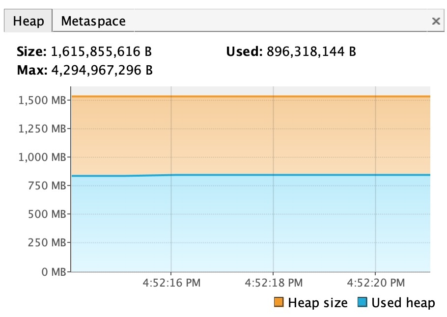
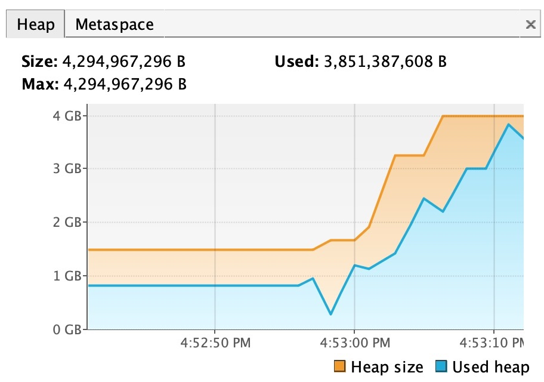
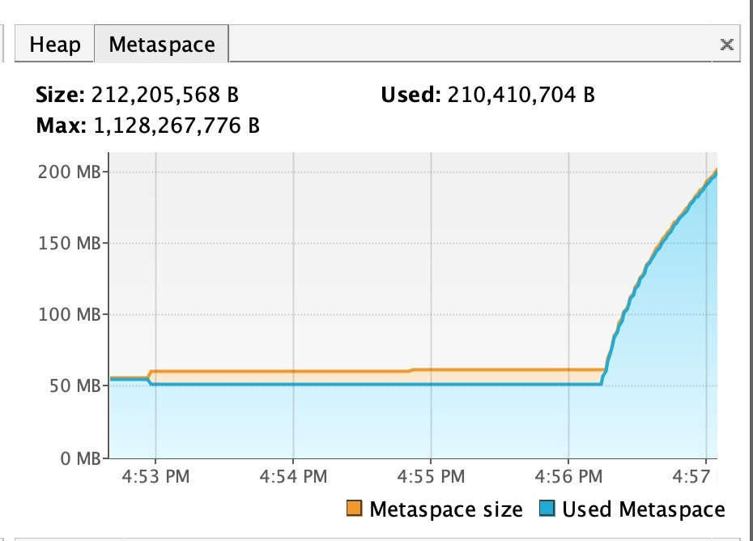
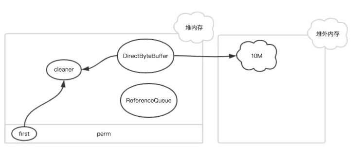

# blade create jvm OutOfMemoryError
## 介绍
内存溢出场景，命令可以简写为：blade c jvm oom

## 参数
以下是此场景特有参数，通用参数详见：[blade create jvm](blade create jvm.md)
```
--area string        JVM 内存区，目前支持 [HEAP, NOHEAP, OFFHEAP]，必填项。用Heap来表示Eden+Old，,用NOHEAP来表示metaspace，用OFFHEAP来表示堆外内存
--block string       指定对象大小，仅支持 HEAP 和 OFFHEAP 区，单位是 MB
--interval string    单位ms,默认500两次oom异常间的时间间隔，只有在非暴力模式才生效，可以减缓gc的频率，不用担心进程会无响应
--wild-mode string   默认false,是否开启暴力模式，如果是暴力模式，在OOM发生之后也不会释放之前创建的内存，可能会引起应用进程无响应
```

## 案例
堆内存占用：
```
blade c jvm oom --area HEAP --wild-mode true --process tomcat

{"code":200,"success":true,"result":"99b9228b9632e043"}
```
故障注入之前：


故障注入之后：


停止 HEAP 内存占用：
```
blade d 99b9228b9632e043
```

创建 Metaspace 区内存占用，注意，执行完此场景后，需要重启应用！！！！：
```
blade c jvm oom --area NOHEAP --wild-mode true --process tomcat

{"code":200,"success":true,"result":"93264dd07149cf54"}
```

故障注入后：



## 实现原理
### 根据不同区注入
#### java.lang.OutOfMemoryError: Java heap space
创建
Heap的话分为Young，Old，这块区域的oom是最好重现，只需要不断的创建对象就可以，如果内存使用达到了 Xmx或者Xmn所规定的大小，并且gc回收不了,就会触发oom错误。

检查
• 可以通过 jmap -heap pid 来查看当前堆占用情况是否到了100%
• 可以通过jstat -gcutil pid 来查看是否发生了gc,因为会一直创建新的对象，所以会频繁触发gc操作

恢复
当演练终止后，会停止产生新的对象，但此时不一定heap就恢复了，因为恢复需要触发gc才可以进行回收,当然也可以通过手动调用 System.gc()来强行触发gc，但是如果你的启动参数里面有  -XX:+DisableExplicitGC  那么这个命令就无法生效了.

注意
触发OOM的时候可能会导致进程被操作系统所kill，这个原因是因为你的Xmx设置的不合理，比如操作系统内存只有3G，但是你Xmx会设置了3G甚至更多，那么就会因为系统内存不足，而被os kill掉进程，所以这里务必要注意Xmx大小

#### java.lang.OutOfMemoryError: Metaspace
创建
Metaspace可以通过不断的加载类对象来创建，当大小超过了 -XX:MaxMetaspaceSize 并且无法进行gc回收就会抛出 oom错误了

检查
• 可以通过jstat -gcutil pid 来查看 M区的使用情况以及gc的次数

恢复
类对象的回收条件在jvm里面比较苛刻，需要满足很多条件，就算满足了条件，触发gc了也不一定回收,只要有下面任何一个条件就无法被回收.
• objects of that class are still reachable.
• the Class object representing the class is still reachable
• the ClassLoader that loaded the class is still reachable
• other classes loaded by the ClassLoader are still reachable
因此最好的办法就是重启应用.

#### java.lang.OutOfMemoryError: Direct buffer memoryDirectBuffer


创建
堆外内存可以直接通过ByteBuffer.allocateDirect 来产生,并且会一直消耗系统内存.

检查
• 因为堆外内存不属于堆里面，所以你通过jmap命令很难发现，但是可以通过 jstat -gcutil pid  来查看，如果频发出发了fullgc，但是e,O,M区都没发生变化， 那就是进行堆外内存回收
• 可以通过free -m 查看内存使用情况

注意
同样，如果没有设置最大堆外内存大小，同样会因为OS的memory耗尽而导致进程被杀，所以需要配置比如下面的参数:
-XX:MaxDirectMemorySize=100M

## 常见问题