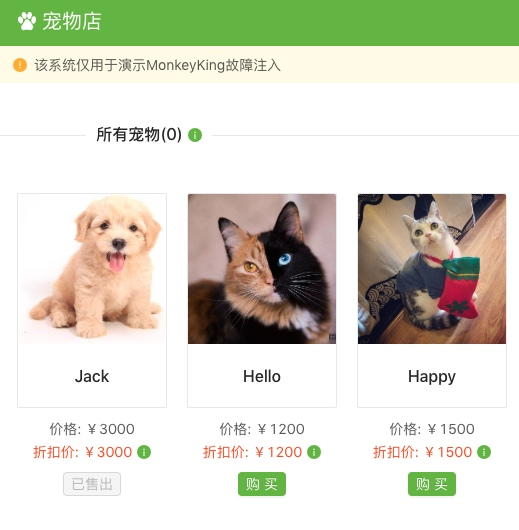
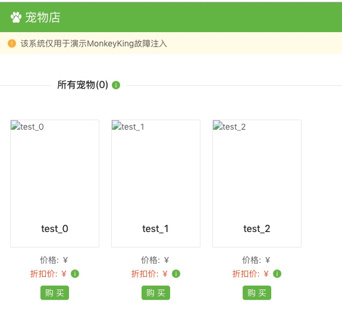

# blade create jvm script
## 介绍
编写 java 或者 groovy 脚本实现复杂的故障场景，比如篡改参数、修改返回值、抛自定义异常等

## 参数
以下是此场景特有参数，通用参数详见：[blade create jvm](blade create jvm.md)
```
--effect-count string     影响的请求条数
--effect-percent string   影响的请求百分比
--script-content string   脚本内容，是 Base64 编码后的内容，相关工具类 [Base64Util](https://github.com/chaosblade-io/chaosblade-exec-jvm/blob/master/chaosblade-exec-plugin/chaosblade-exec-plugin-jvm/src/main/java/com/alibaba/chaosblade/exec/plugin/jvm/Base64Util.java)。注意，不能和 script-file 同时使用。
--script-file string      脚本文件，文件绝对路径
--script-name string      脚本名称，日志记录用，可不填写。
--script-type string      脚本类型，取值为 java 或 groovy，默认为 java。
```

使用 script-content 指定演练脚本内容，不添加 script-type 参数，默认为 java 脚本，将调用 java 引擎解析器。
```
blade c jvm script --classname com.example.controller.DubboController --methodname call --script-content aW1wb3J0IGphdmEudXRpbC5NYXA7CgppbXBvcnQgY29tLmV4YW1wbGUuY29udHJvbGxlci5DdXN0b21FeGNlcHRpb247CgovKioKICogQGF1dGhvciBDaGFuZ2p1biBYaWFvCiAqLwpwdWJsaWMgY2xhc3MgRXhjZXB0aW9uU2NyaXB0IHsKICAgIHB1YmxpYyBPYmplY3QgcnVuKE1hcDxTdHJpbmcsIE9iamVjdD4gcGFyYW1zKSB0aHJvd3MgQ3VzdG9tRXhjZXB0aW9uIHsKICAgICAgICBwYXJhbXMucHV0KCIxIiwgMTExTCk7CiAgICAgICAgLy9yZXR1cm4gIk1vY2sgVmFsdWUiOwogICAgICAgIC8vdGhyb3cgbmV3IEN1c3RvbUV4Y2VwdGlvbigiaGVsbG8iKTsKICAgICAgICByZXR1cm4gbnVsbDsKICAgIH0KfQo=  --script-name exception
```

使用 script-file 参数指定文件演练：
```
blade c jvm script --classname com.example.controller.DubboController --methodname call --script-file /Users/Shared/IdeaProjects/Workspace_WebApp/dubbodemo/src/main/java/com/example/controller/ExceptionScript.java --script-name exception
```

执行 groovy 脚本实验场景，参数同上，但必须添加 --script-type groovy 参数。如
```
blade c jvm script --classname com.example.controller.DubboController --methodname call --script-file /Users/Shared/IdeaProjects/Workspace_WebApp/dubbodemo/src/main/java/com/example/controller/GroovyScript.groovy --script-name exception --script-type groovy 
```
## 脚本规范
* 必须创建一个类，对类名和包名没有要求，其中所依赖的类，必须是目标应用所具备的类。
* 同包下的类引用，必须写全包名，比如故障脚本类是 com.example.controller.ExceptionScript，类中引入了同包下的 DubboController 类，则 DubboController 必须添加 com.example.controller.DubboController。引入非同包下的类，无需写全包名。
* 必须添加 public Object run(Map<String, Object> params) 方法，其中 params 对象中包含目标方法参数，key 是参数索引下标，从 0 开始，比如目标方法是 public String call(Object obj1, Object obj2){}，则 params.get("0")则返回的是 obj1 对象，可以执行params.put("0", <NEW OBJECT>) 来修改目标方法参数（目标方法及 --classname 和 --methodname 所指定的类方法）。
* 上述方法返回的对象如果不为空，则会根据脚本中返回的对象来修改目标方法返回值，注意类型必须和目标方法返回值一致。如果上述方法返回 null，则不会修改目标方法返回值。

## 案例
对以下业务类做修改返回值实验场景：
```
@RestController
@RequestMapping("/pet")
public class PetController {

    @GetMapping("/list")
    public Result<List<PetVO>> getPets() {
        Map<Long, Discount> petDiscount = discountManager
            .getPetDiscounts()
            .stream()
            .filter(discount -> discount.getExpired() == 0)
            .collect(Collectors.toMap(
                Discount::getPetId,
                Function.identity()
            ));

        List<PetVO> pets = petManager
            .getPets()
            .stream()
            .map(pet -> {
                PetVO petVO = PetVO.from(pet);
                Discount discount = petDiscount.get(pet.getId());

                if (null != discount && null != discount.getDiscountPrice() && discount.getDiscountPrice() > 0L) {
                    petVO.setDiscountPrice(discount.getDiscountPrice());
                }

                return petVO;
            })
            .collect(Collectors.toList());

       return Result.success(pets);
    }
```

则编写 Java 脚本，实现对 getPets 方法做返回值修改：
```
package com.alibaba.csp.monkeyking.controller;

import java.util.ArrayList;
import java.util.List;
import java.util.Map;

import com.alibaba.csp.monkeyking.demo.model.Pet;
import com.alibaba.csp.monkeyking.model.PetVO;
import com.alibaba.csp.monkeyking.model.Result;

public class ChaosController {

    public Object run(Map<String, Object> params) {
        ArrayList<PetVO> petVOS = new ArrayList<>();
        for (int i = 0; i < 3; i++) {
            Pet pet = new Pet();
            pet.setName("test_" + i);
            PetVO petVO = PetVO.from(pet);
            petVOS.add(petVO);
        }
        Result<List<PetVO>> results = Result.success(petVOS);
        return results;
    }
}
```
保存文件后，通过上面 使用方式 部分的命令来调用，也可以将其进行 Base64 编码，通过指定 script-content 参数来指定编码后的内容。
```
blade c jvm script --classname com.alibaba.csp.monkeyking.controller.PetController --methodname getPets --script-file /Users/Shared/IdeaProjects/Workspace_WebApp/dubbodemo/src/main/java/com/alibaba/csp/monkeyking/controller/ChaosController --script-name specifyReturnObj
```

未执行实验之前页面：


执行实验之后：



## 常见问题
Java 实验场景的日志在 进程用户下 logs/chaosblade/chaosblade.log 中。执行脚本成功，但不生效，原因可能是脚本编译错误（因为脚本编译方法调用时触发，所以下发脚本，不会进行编译），可查看此日志进行排查。